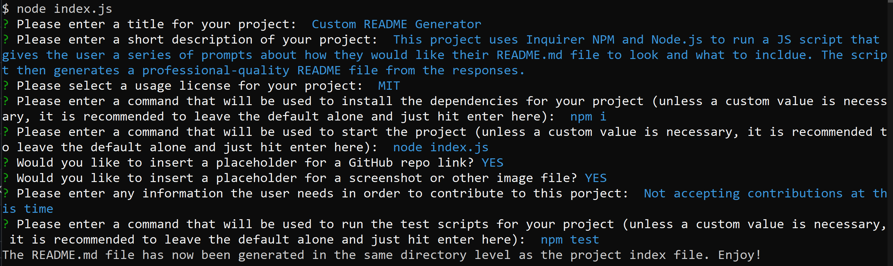

# Custom README Generator


## Description

This project uses Inquirer NPM and Node.js to run a JS script that gives the user a series of prompts about how they would like their README file to look and what to include. The script then generates a professional-quality README.md file from the responses at the index level of the project directory.

## Table of Contents 

* [Installation](#installation)

* [Usage](#usage)

* [License](#license)

* [GitHub Repo](#github-repo)

* [Contributing](#contributing)

* [Testing](#testing)

* [Questions](#questions-and-contact-info)

## Installation

To install necessary dependencies, run the following command in the console/command line:

```
npm i
```

## Usage

To begin running the program, run the following command in the console/command line:

```
node index.js
```

## License

This project is licensed under the MIT license. Learn more [HERE](LICENSE)

## GitHub Repo

https://github.com/ericwittenstein/README-Generator-v1

## Project Demo



## Contributing

Not accepting contributions at this time

## Testing

To initiate the unit tests for this project, run the following command in the console/command line: 

```
npm test
```

## Questions and Contact Info

If you have any questions about the repo, please open an issue on GitHub or contact me directly at [eric.wittenstein@gmail.com](mailto:eric.wittenstein@gmail.com).

You can find more of my work at [github.com/ericwittenstein/](https://github.com/ericwittenstein/).

<!-- EHW SIGNET
---------
    |
  -----
    |
---------
 -->

### Eric Wittenstein

